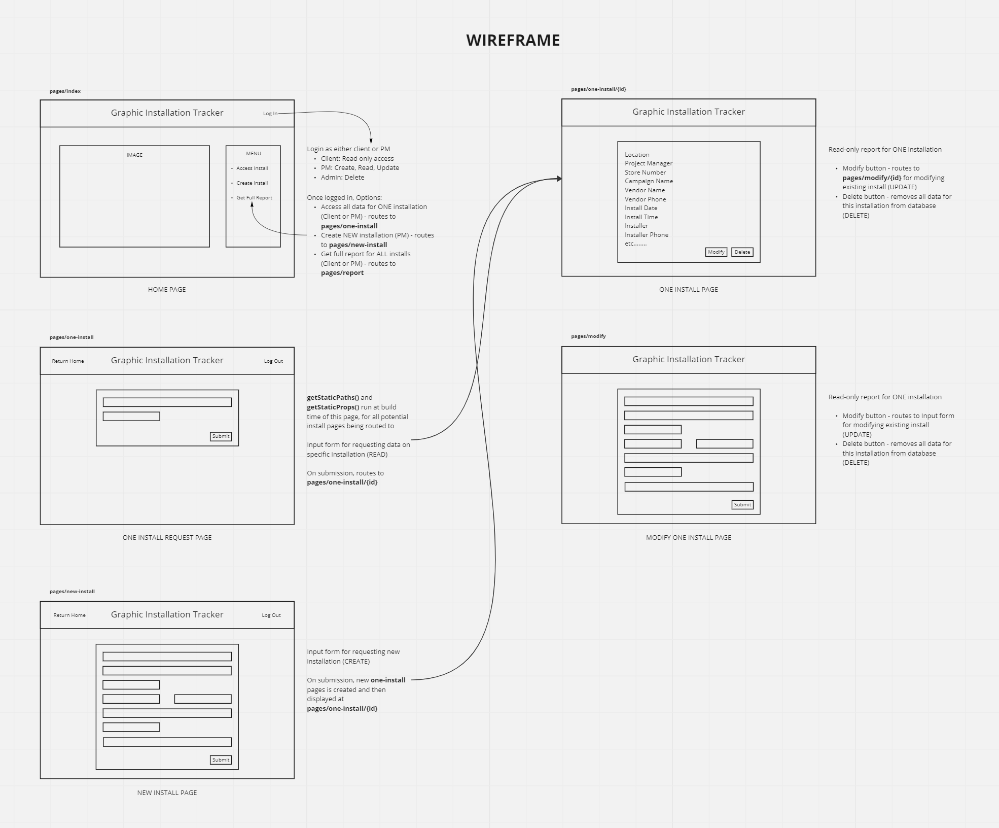
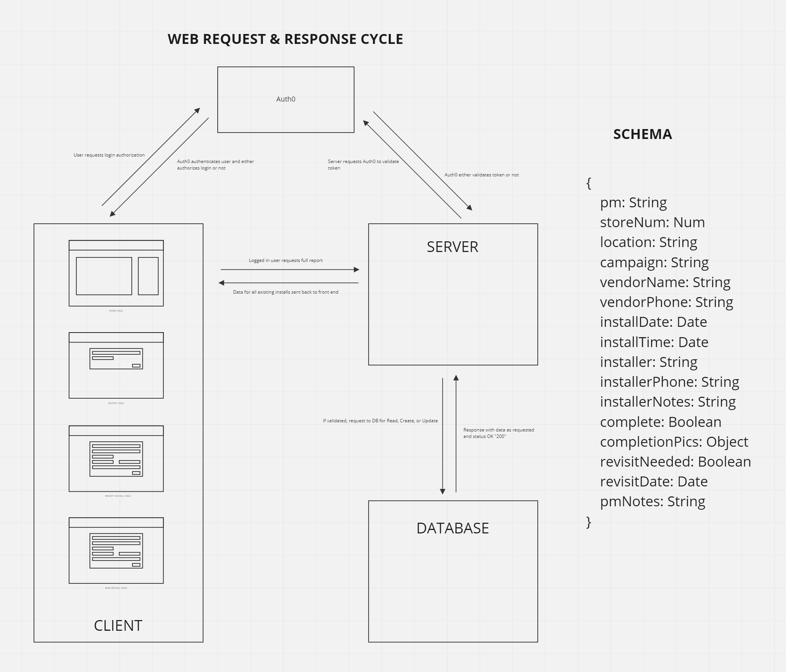

# Graphic Installation Tracker - Frontend

## A tracking and reporting app for retail graphic installs

**Author:** Guy Farley

## How to Run This Application

## Problem Domain

In my previous career as a project manager for retail marketing, I was often tasked with managing nationwide installations of displays and signage. I quickly identified the need for a central portal, where all vital information surrounding such a rollout could be easily tracked and reported to the client.

During large campaign rollouts, graphic kits (consisting of printed and manufactured retail displays) would be shipped to hundreds of retail locations across the country. It was always essential that all installations happened as close to the product launch date as possible, and this resulted in a massive number of installations happening within a small window of time.

There was no software in place to help manage the data surrounding these installs, and the client often demanded updates in real time. The best solution at the time was to manage information within a shared Google doc or Smartsheet, but this was slow and cumbersome. What was needed was an application specific to graphic installs that could be securely logged into for access to information on an install (or all installs) instantly.

**User Stories:**

- As a **Project Manager** I need a central hub of information for all installations related to a given marketing campaign. I need to enter and modify data for each location as needed

- As a **Client** I need a way to quickly track the status of:
  - Installation at a *single* location
  - All installations at *all* locations

- As an **Admin** I need the ability to delete installs from the database

## Features / Routes

- **GET:** Request data for a single install at a given location *(READ)*
- **GET ALL:** Request all data for all locations, to be displayed as a full report *(READ)*
- **POST:** Add a new install to the database *(CREATE)*
- **PUT:** Modify an existing install at a given location *(UPDATE)*
- **DELETE:**: Delete an existing install at a given location *(DELETE)*

## Challenges & Constraints

- **Challenge:**

## Visual Documentation

### Wireframe

Before determining the data flow of my application, I first created a wireframe to help visualize how the final application would appear to the end user. This was the first step in determining how the app would function, as it required me to think through the user's experience and how they would be best served by the architecture.

Through this wireframe process, I recognized the need for the following pages:

- Home Page (pages/index)
  - Report Request (all locations)
  - Report Request (single location)
  - Create Install (single location)
- Single Install (pages/one-install/{id})
- New Install Request (pages/new-install)
- Report for All Install Locations (pages/report)
- Single Install Modification Request (pages/modify)

Visual Representation:

### Web Request/Response Cycle

## Tech Stack

Having recently learned the basics of Typescript, I wanted to incorporate the benefits of type safety into this app. And the Next.js framework, which sits on top of React, allows for easy incorporation of Typescript.

On the back end, I decided to use Next's built-in API routes to handle the various database requests - eliminating the need for a separate backend server application. And for the database itself I chose a PostgreSQL database hosted on Amazon RDS. I've incorporated the Prisma ORM to help the app communicate with the database.

Application state is managed using the Context API. Tailwind CSS used for styling.

## Links and Resources

Wireframing and Web Request/Response Cycle: <https://miro.com/app/board/uXjVPRDCNRU=/>

<https://nextjs.org/docs/getting-started>
