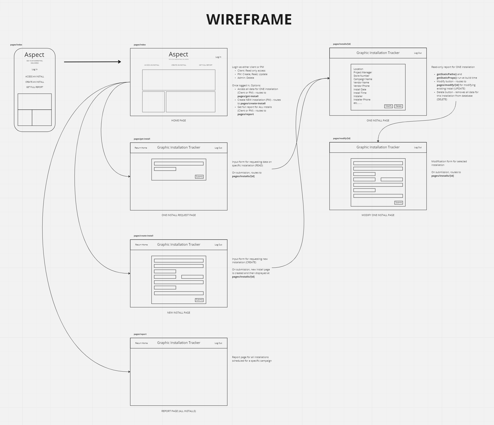

# Graphic Installation Tracker - Frontend

## A tracking and reporting app for retail graphic installs

**Author:** Guy Farley

## How to Run This Application

Deployed at <https://aspect-install-tracker.vercel.app/>

## Problem Domain

In my previous career as a project manager for retail marketing, I was often tasked with managing nationwide installations of displays and signage. I quickly identified the need for a central portal where all vital information surrounding such a rollout could be easily tracked and reported to the client.

During large campaign rollouts, graphic kits (consisting of printed and manufactured retail displays) would be shipped to hundreds of retail locations across the country. It was always essential that all installations happened as close to the product launch date as possible, and this resulted in a massive number of installations happening within a small window of time.

There was no software in place to help manage the data surrounding these installs, and the client often demanded updates in real time. The best solution at the time was to manage information within a shared Google doc or Smartsheet, but this was slow and cumbersome. What was needed was an application specific to graphic installs that could be securely logged into for access to information on an install (or all installs) instantly.

**User Stories:**

- As a **Project Manager** I need a central hub of information for all installations related to a given marketing campaign. I need to enter and modify data for each location as needed, and to delete an installation if necessary

- As a **Client** I need a way to quickly track the status of:
  - Installation at a *single* location
  - All installations at *all* locations

## Features / Routes

- **GET:** Request data for a single install at a given location *(READ)*
- **GET ALL:** Request all data for all locations, to be displayed as a full report *(READ)*
- **POST:** Add a new install to the database *(CREATE)*
- **PUT:** Modify an existing install at a given location *(UPDATE)*
- **DELETE:**: Delete an existing install at a given location *(DELETE)*

## Challenges & Constraints

**Challenge:** Data management between Next.js app and PostgreSQL database

- This was the single biggest challenge I faced while building the app. I needed the ability to dynamically create routes and pages for each install location - but with Next.js, these are pre-rendered at build time. This created a couple of separate issues that I had to work through:

  - **How to render at build time using data from the database, while keeping all data updated in real time during the user session.** Initially, I built each page to make an API call for the most recent data. This felt ideal because it kept the database as the "single source of truth" throughout the user session. But not only was this inefficient due to endless API calls, it did not take into account that each page would be rendered *once* using the initial data pull, and then not rendered again when revisited.

  - **How I solved the issue:** I decided to parallel-path the data management, using the Context API for application state while simultaneously updating the database as needed. When the home page was intially loaded, I would set all installations into state using the Context API and then (if data existed in state) pull the data from Context instead of from the database. This worked well, but there was another issue to solve:

  - **How to allow NEW dynamic routes to be created after initial page render.** What would happen if I added a new install to the campaign and then tried to access that data? The data would exist in state and be accessible, sure. But the routes and pages had already been created - without including the new ones! The result was 404 errors all day long.

  - **How I solved the issue:** In the end, this ended up being a very simple solution: Within the `return` statement on the `getStaticPaths()` function, I just needed to set `fallback: 'blocking'`. This essentially allowed the addition of new paths after the function had been run the first time. Problem solved!

**Challenge:** Building from a mobile-first perspective.

- While I'm not a huge fan of the inline styling approach, I did find Tailwind CSS to be pretty intuitive for building from a mobile-first philosophy. The ease of changing an element's styling at pre-determined breakpoints allowed me to quickly build for mobile devices, and then easily change that styling as the user's window expands.

## Visual Documentation

### Wireframe

Before determining the data flow of my application, I first created a wireframe to help visualize how the final application would appear to the end user. This was the first step in determining how the app would function, as it required me to think through the user's experience and how they would be best served by the architecture.

Through this wireframe process, I recognized the need for the following pages:

- Home Page (pages/index)
  - Report Request (single location)
  - Create Install (single location)
- Single Install (pages/one-install/{id})
- New Install Request (pages/new-install)
- Single Install Modification Request (pages/modify)

Visual Representation:

### Web Request/Response Cycle

## Tech Stack

**Frontend:**

- TypeScript
- React.js
- Next.js
- Prisma
- Tailwind CSS

**Backend:**

- Next.js API routes
- PostgreSQL database hosted on Amazon RDS

Having recently learned the basics of Typescript, I wanted to incorporate the benefits of type safety into this app. And the Next.js framework, which sits on top of React, allows for easy incorporation of Typescript.

On the back end, I decided to use Next's built-in API routes to handle the various database requests - eliminating the need for a separate backend server application. And for the database itself I chose a PostgreSQL database hosted on Amazon RDS. I've incorporated the Prisma ORM to help the app communicate with the database.

Application state is managed using the Context API. Tailwind CSS used for styling.

## Links and Resources

**Documentation:**

- Next.js Docs: <https://nextjs.org/docs/getting-started>

- PostgreSQL Docs: <https://www.postgresql.org/docs/>

- Prisma Docs: <https://www.prisma.io/docs>

- pgAdmin Docs: <https://www.pgadmin.org/docs/>

- Tailwind CSS Docs: <https://tailwindcss.com/docs/installation>

- Hero Icons: <https://heroicons.com/>

- React Icons: <https://react-icons.github.io/react-icons/>

**Helpful Tutorials:**

- Wireframing and Web Request/Response Cycle: <https://miro.com/app/board/uXjVPRDCNRU=/>

- Typescript NextJS Tutorial: Build a Netflix 🍿 Clone Part 1 - Homepage UI with TailwindCSS: <https://www.youtube.com/watch?v=cwqNAkwhKqw>

- Build A Responsive Next JS Website Using Tailwind CSS - Beginner Guide: <https://www.youtube.com/watch?v=HVyct9EUNP8>

- How to Style a Form With Tailwind CSS: <https://css-tricks.com/style-form-tailwind-css/>

- How to use Next.js API Routes? <https://refine.dev/blog/next-js-api-routes/>

- Creating an RDS PostgreSQL Database on the AWS Free Tier: <https://www.youtube.com/watch?v=I_fTQTsz2nQ>

- Create Postgres Server in AWS and Connect with PGadmin: <https://www.youtube.com/watch?v=5HxIZramJHo>

- Prisma & Next.js: <https://www.youtube.com/watch?v=8DiT-LdYXC0>

- Prisma - The Easiest Way to Work with a Database in Next.js (UPDATED): <https://www.youtube.com/watch?v=FMnlyi60avU>
